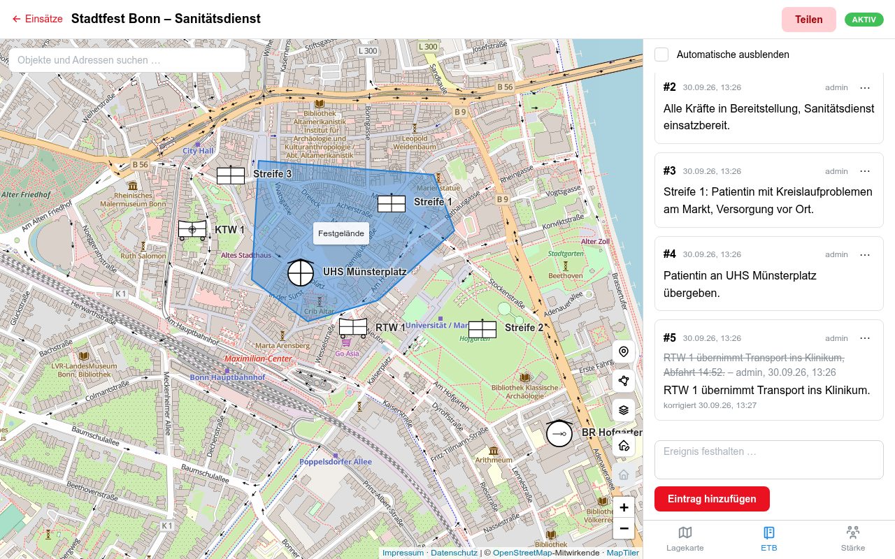
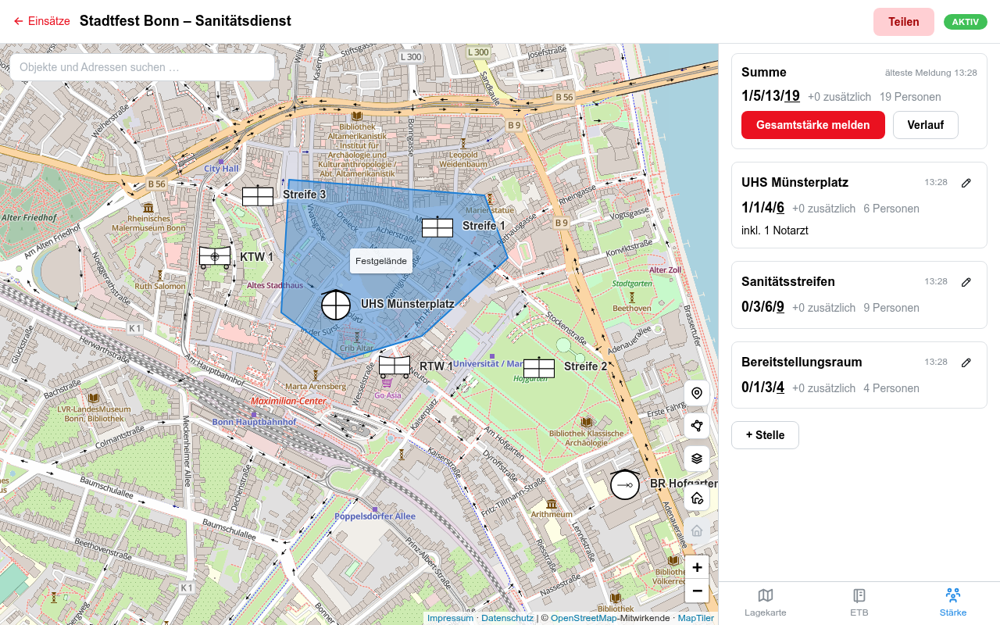
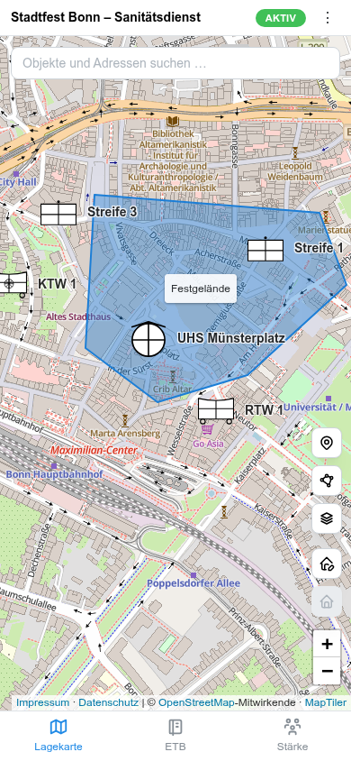

# Einsatz

An incident response management system for a volunteer medical service.

Primarily a testing ground for my [skill collection](https://github.com/jorgenschaefer/skills). Use at your own risk.

The user interface and the domain language are German.



<p>
  
  
</p>

## Features

- **Operations** (Einsätze), each with its own situation map and journal.
- **Situation map** (Lagekarte) on OpenStreetMap with tactical symbols following
  DV 102, drawn areas (polygons, lines, circles), KML overlays and image
  overlays from PDF or PNG site plans.
- **Operations journal** (Einsatztagebuch, ETB): numbered, timestamped entries;
  corrections and annulments stay visible as struck-through history.
- **Strength reports** (Stärkemeldungen) per station, with totals and history.
- **Live position tracking**: a secret device link (with QR code) per map
  symbol lets a phone report its location without logging in.
- **Read-only view links** to share the map without an account.
- Live updates for all viewers via server-sent events.

The domain vocabulary is defined in [UBIQUITOUS_LANGUAGE.md](UBIQUITOUS_LANGUAGE.md).

## Tech stack

Next.js (App Router), React, TypeScript, Mantine, Leaflet, PostgreSQL.
Tested with Vitest and Testing Library, linted and formatted with Biome.

## Getting started

Requirements: Node.js (version in [.nvmrc](.nvmrc)) and Docker for PostgreSQL.

```sh
npm install
cp .env.example .env          # then set ADMIN_PASSWORD
docker compose up -d          # PostgreSQL on localhost:5436
npm run db:migrate            # create or update the schema
npm run db:seed               # create the first admin user
npm run dev                   # http://localhost:3000
```

Log in with the `ADMIN_USERNAME` and `ADMIN_PASSWORD` from `.env`.

## Configuration

| Variable           | Purpose                                                                                     |
| ------------------ | ------------------------------------------------------------------------------------------- |
| `DATABASE_URL`     | PostgreSQL connection string.                                                               |
| `ADMIN_USERNAME`   | Username of the first admin, created by `npm run db:seed`. Needed only while there are no users. |
| `ADMIN_PASSWORD`   | Password of the first admin. Needed only while there are no users. See the password rules below. |
| `MAPTILER_API_KEY` | Optional. MapTiler key for map tiles; without it the public OSM tile server is used.        |
| `UPLOADS_DIR`      | Optional. Where uploaded images are stored; defaults to `data/uploads` in the working directory. |

Every password, the first admin's included, must be 12 characters to 72 bytes
long (an umlaut counts as two bytes), must not be one of the 10,000 most common
passwords ([SecLists](src/server/auth/common-passwords.LICENSE)), and must not
equal the username, ignoring case. Usernames are unique, ignoring case.

## Development

```sh
npm run check     # type check, lint and tests; must pass before a change is done
npm run format    # apply the Biome formatter
npm run test:watch
```

Database tests need a throwaway PostgreSQL that keeps its data in memory:

```sh
docker compose -f docker-compose.test.yml up -d    # localhost:5437
```

Each test gets its own database cloned from a migrated template, so tests never
touch the development database. Set `TEST_DATABASE_URL` to use a different
server. Tests that do not use the database run without the container.

## Deployment

The [Dockerfile](Dockerfile) builds a production image. On start the container
runs the migrations, makes sure the first admin exists and then starts the
server on port 3000. [docker-compose.prod.yml](docker-compose.prod.yml) shows a
setup with an external database and a volume for uploads; set `UPLOADS_DIR` to
the mounted path.

## License

Copyright (C) 2026 Jorgen Schaefer

This program is free software: you can redistribute it and/or modify it under
the terms of the GNU Affero General Public License as published by the Free
Software Foundation, either version 3 of the License, or (at your option) any
later version. See [LICENSE](LICENSE) for the full text.
